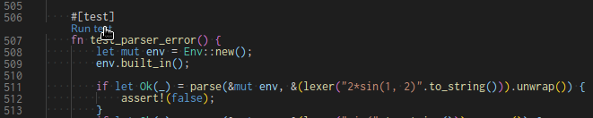

Design Note of `rc`
===================
Table of Contents
-----------------

* [目的](#目的)
* [Lexer](#lexer)
    * [StringとVec<char>の変換](#stringとveccharの変換)
    * [String => Vec<char>](#string--vecchar)
    * [Vec<char> => String](#vecchar--string)
* [Parser](#parser)
    * [整数・浮動小数点数・複素数](#整数浮動小数点数複素数)
    * [Enum](#enum)
* [Evaluator](#evaluator)
    * [複素数演算](#複素数演算)
* [MyError](#myerror)
    * [thiserror](#thiserror)
    * [anyhow](#anyhow)
* [Command](#command)
* [変数・定数](#変数定数)
* [システム定義関数](#システム定義関数)
    * [exp()](#exp)
* [ユーザ定義関数](#ユーザ定義関数)
* [オブジェクト指向](#オブジェクト指向)
* [ファイル分割](#ファイル分割)
* [端末制御](#端末制御)
    * [括弧の強調](#括弧の強調)
* [コマンドラインオプション](#コマンドラインオプション)
    * [バージョン情報の自動取得](#バージョン情報の自動取得)
* [テスト](#テスト)
* [インクリメンタルな開発](#インクリメンタルな開発)
* [開発環境](#開発環境)
* [Static link](#static-link)
    * [Linux](#linux)
    * [Windows](#windows)
* [GitHub Actions](#github-actions)
    * [Raspberry Pi](#raspberry-pi)

Created by [gh-md-toc](https://github.com/ekalinin/github-markdown-toc)


## 目的

従来、PC上での電卓としてiMemoを使っていた。Windows上で動くフリーソフトで、その名のとおり複素数計算ができる、かなり高機能な関数電卓ソフトだ。数式を入力して科学技術計算ができるのが便利で起動も早い。しかし、英語Windows環境では文字化けしたり、Linux（PC, RaspberryPiなど）でも同様の電卓が使いたかったり（`bc`では力不足）するので、勉強も兼ねて自作しようというのが作成の動機。2020年の冬もコロナの影響で冬ごもりになる予定だし、プロジェクトとしてはちょうどよいだろう、というのも理由。開発言語は個人的な好みによりRust。

最低限必要な機能としては次のようなものだ。

* コマンドラインで気軽に起動してすぐに計算が実行できる。
* 数式どおりの入力が使える。科学技術・エンジニアリング関数を備え、複素数計算も可能。
* 10進だけでなく16進、2進も取り扱える。
* 簡単なコマンドライン編集が可能。
* WindowsとLinuxのターミナル上で動作する。

将来的にはフィルターなどのグラフ特性が書けるとありがたいが、実装はしばらく先になるだろう。

日常の設計業務でドッグフードを食べてみて不自由しないレベルになったので公開することにした。

この記事では設計や実装についての解説を行う。

ソフトの使い方については[README.md](README.md)や[README-j.md](README-j.md)を参照していただきたい。

## Lexer

構成としては、オーソドックスに、Lexer（トークナイザ）→Parser→Evaluator（評価器）の3層構造とする。

Lexerは1行入力として`String`を受け取り、それをトークン列に分解し`Result<Vec<Token>, String>`を返す。

`Token`は`enum`として実装する。それぞれの枝に値を持っている。

```rust
#[derive(Debug, Clone, PartialEq)]
pub enum Token {
    Num(i128),
    FNum(f64),
    Op(TokenOp),
    Ident(String),
}
```

Lexerの特徴として、`-100`を、単項演算子`-`と整数リテラル（`100`）へ分解するようにしている。単項演算子として`-`を消費してしまうほうが簡単な実装になるからだ。デメリットとしては、たとえば`u8`で−128を表すことができなくなる。

入力は`Vec<char>`に変換してインデックスでアクセスする。Iteratorを使わない。この方が型修飾を減らしてCっぽく実装できる。トークナイザは文字配列と現在注目している文字列のインデックスを受け取り、解析した結果のトークンと更新されたインデックスの2つを返す必要がある。複数の値を返す時には、参照引数の値を変更する（`&mut`で引数を受け取って変更する）のではなく、複数の値を返す。このスタイルはRust API Guidelineの[C-NO-OUT](https://sinkuu.github.io/api-guidelines/predictability.html#c-no-out)にも定められている。


```rust
fn tok_ident(chars: &[char], index: usize) -> (Token, usize) {
    let mut i = index;
    let mut ret = String::new();
    while i < chars.len() {
        match chars[i] {
            'a'..='z' | 'A'..='Z' | '_' | '0'..='9' => {
                ret.push(chars[i]);
                i += 1;
            }
            _ => {
                return (Token::Ident(ret), i);
            }
        }
    }
    (Token::Ident(ret), i)
}
```

### `String`と`Vec<char>`の変換

Rustの`String`は文字の配列ではない。毎回ググっているが、イデオムをまとめておく。

#### `String` => `Vec<char>`

`chars()`でイテレータを取り出し、`collect()`で集約する。型ヒントとして`Vec<char>`が必要。そうしないと`Vec<u8>`と区別が付けられない。

#### `Vec<char>` => `String`

`FromIterator`という標準クレートを使うと楽。

```rust
use std::iter::FromIterator;
let s = String::from("abcdef");
let chars: Vec<char> = s.chars().collect();
let s2 = String::from_iter(chars);
```

#### `to_owned()` vs. `to_string()`

`&str`型の固定文字列を`String`に変換するときは`to_owned()`の方が若干効率が良い。
`to_string()`は一般のオブジェクトを`String`に変換するためのメソッド。`to_owned()`の方が`&str`に特殊化されている。

## Parser

ParserとEvaluatorは再帰がすべて。手書きの再帰降順パーサ（Recursive descending parser）を用いてトークン列をASTに変換する。EvaluatorはASTを再帰的に辿って式の値を決定する。文法と評価ツリーのトラバースがしっかりと設計できていれば、自分の予想外のことまでうまくいく。単純な再帰ではなく、複数の関数の間を循環するような再帰になっているので、どこに再帰させるかを間違えないようにだけ注意が必要。

Parserは`Vec<Token>`を受け取り、`Result<(Node, usize), MyError>`を返す。`Node`は下に示す`Enum`である。必要な場合には子要素（Nodeへのポインターなど）を持ち、ツリーを構成する。Lexerとおなじく、入力はIteratorではなく配列とインデックスでアクセスする。トークンを食べたあとの新しいインデックスはLexerと同様にタプルとして返す。

昔、Cでインタプリタを作った時は、構造体ではなく共用体を用いてメモリを節約した。RustのEnumは、たぶんそれを自動でやってくれる。

```rust
#[derive(Debug, Clone, PartialEq)]
pub enum Node {
    None,
    Num(i128),
    FNum(f64),
    CNum(Complex64),
    Unary(Token, Box<Node>),                 // TokenOp, Operand
    BinOp(Token, Box<Node>, Box<Node>),      // TokenOp, LHS, RHS
    Var(Token),                              // Token::Ident
    Func(Token, Vec<Node>),                  // Token::Ident, args...
    Command(Token, Vec<Token>, String),      // Token::Ident, args..., result-holder
}
```

### 整数・浮動小数点数・複素数

`rc`は科学技術計算用計算機なので、整数、浮動小数点数、複素数を扱うことができる。実装は、上の`Node`で示したように`Enum`を用いている。それぞれの枝の中に`i128`,`f64`,`Complex64`として格納する。多倍長整数（BigNum）や有理数は未実装。必要に応じて整数→浮動小数点数→複素数へ格上げして計算を実行する。標準ライブラリのように`Trait`をうまく使えば自然な表現を実現できそうだが、今は単純に場合分けによる実装としている。

### Enum

当初、Cでの類似の実装経験から、Node構造体などをStructで表し、Node.Typeといったメンバー変数で処理を分岐するように書いていた。その後、Rustらしく、タグでの分岐をEnumの型タグによる分岐に修正した。処理漏れもなくなるし、余計な初期化や分岐も無くなった。短くて情報量が多い、なんというか「力強い」コードになる。Enumの威力を実感した。

## Evaluator

Parserが返したASTを再帰的にevalすることで計算結果を得る。`Node`を受け取って、計算を実行するなど簡約化した結果の`Node`を返す。

### 複素数演算

複素演算を実装するには、プログラミングだけでなく、複素演算自体の知識も必要となる。ただし、今回の実装では精度を追い求めることはせず、ライブラリ関数を全面的に信用してそれを利用することにする。

rustでは`use num_complex::Complex64;`とすれば、`(re: f64, im: f64)`と言う形の複素数、およびそれらを引数にとる複素関数を使うことができる。

複素数演算の基本はべき乗関数（`power()`）である。これはライブラリにあるので、引数の型（正整数、整数、浮動小数点数、複素数）に会わせて呼んでやるだけで良い。`TokenOp::Caret`がべき乗演算子（`^`）なので、次のようになる。場合分けが煩雑だが、もともとのライブラリ関数が別々なので仕方がない。

```rust
    if let Node::BinOp(tok, lhs, rhs) = n {
        let lhs = eval(env, lhs)?;
        let rhs = eval(env, rhs)?;
        match tok {
// .....................中略.......................
            Token::Op(TokenOp::Caret) => {
                if let Node::Num(nr) = rhs {
                    if let Node::Num(nl) = lhs {
                        if nr > 0 {
                            return Ok(Node::Num(nl.pow(nr as u32)));
                        } else {
                            return Ok(Node::FNum((nl as f64).powi(nr as i32)));
                        }
                    } else if let Node::FNum(nl) = lhs {
                        return Ok(Node::FNum(nl.powi(nr as i32)));
                    } else if let Node::CNum(nl) = lhs {
                        return Ok(Node::CNum(nl.powi(nr as i32)));
                    }
                } else if let Node::FNum(nr) = rhs {
                    if let Node::Num(nl) = lhs {
                        return Ok(Node::FNum((nl as f64).powf(nr)));
                    } else if let Node::FNum(nl) = lhs {
                        return Ok(Node::FNum(nl.powf(nr)));
                    } else if let Node::CNum(nl) = lhs {
                        return Ok(Node::CNum(nl.powf(nr)));
                    }
                } else if let Node::CNum(nr) = rhs {
                    if let Node::Num(nl) = lhs {
                        return Ok(Node::CNum(Complex64::new(nl as f64, 0.0).powc(nr)));
                    } else if let Node::FNum(nl) = lhs {
                        return Ok(Node::CNum(Complex64::new(nl, 0.0).powc(nr)));
                    } else if let Node::CNum(nl) = lhs {
                        return Ok(Node::CNum(nl.powc(nr)));
                    }
                }
                return Ok(Node::Num(0));
            }
        }
    }
```


浮動小数点のべき乗が計算できるようになれば、世界でもっとも美しいと言われているオイラーの等式（Euler's Identity）を計算してみたくなるだろう。

```
rc> exp(i * pi)
-1+0.00000000000000012246467991473532i
```

虚数部に多少の計算誤差はあるが、`-1`という結果を得られた。

もうひとつ計算してみたいものが、`i^i`だ。虚数単位の`i`を、虚数単位乗したもの。一目見たところ複雑に見えるが、答えは実数になる。

`exp(log(z)) = z`と定義することができるので、`a^b = exp(b * log(a))` と定義することができる。`log(i)`の主値が`(1/2) * pi * i`なので`i * log(i)`の値の1つは`-(1/2) * pi`。よって`i^i = exp(-pi/2)`が解の1つである。これは実数。実際に計算してみた。

```
rc> i^i
0.20787957635076193+0i
```

虚数の虚数乗が実数というだけでなく、字面としても`i^i`は顔文字見たいでおもしろいし、高校数学の知識で計算することができる。読み方も「あいのあいじょう」となかなか良い。


## MyError

Rustではエラー処理に`Result<T,E>`を使う。

最初の実装では`Result<T, String>`が簡便でよいだろう。しかし、それではRustの力を十分に活用できていない。

エラー処理のためにEdition2018では`?`構文が導入されている。2020年現在、Rustのエラー処理の状況は変化が進行中だ。`try!`を使う方法は現在は推奨されていない。

[Rust エラー処理2020](https://cha-shu00.hatenablog.com/entry/2020/12/08/060000)が最新情報をわかりやすく解説している。

雑な理解では、次のような感じだろう。

* `thiserror`は独自エラー型を実装するための便利ツール
* `anyhow`は`Result<T>`でどんなエラーでも投げられるようにするもの

`rc`では、独自エラーを`enum MyError`で定義して`Error`トレイトを継承しておく。下位ライブラリが返すエラーを`From`で変換して`MyError`の一種にする。そうすると、自分のコード内ではとにかく`Result<T,MyError>`を返すことができる。そのように返す型が統一されていれば、`?`でエラーチェックをして、ショートカットリターンが可能だ。

発生したエラーはトップレベルのREPLでキャッチして、ユーザにわかりやすいエラーメッセージを表示し、次の入力受け付けを行う。`unwrap()`などでパニックするのはユーザインターフェイスとしては不適切だ。

### thiserror

`thiserror`は自作のエラーにトレイト実装（`Error`, `Display`, `From`など）を簡単に付けるためのクレートである。`Cargo.toml`に次のように書くことで使えるようになる。

```
[dependencies]
thiserror = "1.0"
```

そのうえで、`use thiserror::Error;`と書けば次のようなマクロが使える。

```rust
#[derive(Error, Debug)]
pub enum MyError {
    #[error("lexer error: {1} {0}")]
    LexerIntError(String, #[source] std::num::ParseIntError),
    #[error("lexer error: {1} {0}")]
    LexerFloatError(String, #[source] std::num::ParseFloatError),
    #[error("parser error: {0}")]
    ParseError(String),
}
```

このように、自分で定義したエラー型に対して、`Display`トレイトを`#[error("...")]`で簡便に定義できることが特徴。フォーマット書式は`fmt!`に準ずる。エラー型は`Enum`でも`Struct`でも良い。

MyErrorを発生させるときは次のようになるだろう。上は、文字列→数値変換で、変換エラーが出た時に、独自の注釈が付いたエラーを返す場合。

```rust
match i128::from_str_radix(&mantissa, radix) {
    Ok(int) => Ok((Token::Num(int), i)),
    Err(e) => Err(MyError::LexerIntError(mantissa, e)),
}
```

次は再帰降順パーサで下位呼び出しがエラーした場合の処置方法。最初の`mul()`呼び出しは左辺（LHS:left hand side）側をパーズ。ここは再帰的に呼ぶだけなので、エラーが起きた場合は`?`でそのまま帰る。ふたつ目の`mul()`呼び出しは右辺のどこかの再帰呼び出しでエラーが起きた場合。これも、このまま上に伝えて帰る。このとき、`i`の範囲が`tok`のインデックスをはみ出していないかをチェックせずに呼び出しているが、呼びだされている`mul`の先頭で（`expr()`の先頭の`tok_check_index!()`のように）チェックしているのでこれはこれで良い。

```rust
fn expr(env: &mut Env, tok: &[Token], i: usize) -> Result<(Node, usize), MyError> {
    if env.is_debug() {
        eprintln!("expr {:?} {}\r", tok, i);
    }
    tok_check_index(tok, i);

    let (mut lhs, mut i) = mul(env, tok, i)?;
    loop {
        if tok.len() <= i {
            return Ok((lhs, i));
        }
        let tok_orig = tok[i].clone();
        match tok[i] {
            Token::Op(TokenOp::Plus) | Token::Op(TokenOp::Minus) => {
                let (rhs, j) = mul(env, tok, i + 1)?;
                i = j;
                lhs = Node::BinOp(tok_orig, Box::new(lhs), Box::new(rhs));
            }
            _ => {
                return Ok((lhs, i));
            }
        }
    }
}
```

もし、ライブラリが発生するエラーをそのまま使う場合は、最初の例とは異なり、次のように`From`トレイトも自動生成できる。ライブラリが返してきた`std::num::ParseFloatError`を、自動生成した`From`トレイトによって`MyError`に変換して`Result<>`で包んで返す。今回の場合は自分でエラー情報を付加したいので、このようにはしていない。

```rust
#[derive(Error, Debug)]
pub enum MyError {
    #[error(transparent)]
    LexerFloatError(#[from] std::num::ParseFloatError),
}
```

```rust
fn tok_num(chars: &[char], index: usize) -> Result<(Token, usize), MyError> {
    let mut mantissa = String::new();

    /// いろいろな処理

    Ok((Token::FNum(mantissa.parse::<f64>()?), i))
}
```

自前のエラー型を定義して、標準のエラー型からの`From`を定義することのメリットは`?`が使えること。つまり、エラー処理を呼び出し側に放り投げる形のショートカットリターンが使えること。つまり、関数を`Result<T,MyError>`を返すように定義しておけば、ライブラリがエラーを発生した場合はライブラリのエラーから`MyError`に`From`によって変換してリータンできる。もちろん、自前のエラーは`MyError`なので、それもリターンできる。いずれも、呼び出し側でエラー処理を行わなければならない。

### anyhow

`anyhow`は、`anyhow::Error`というトレイトオブジェクト、および、`Result<T,anyhow::Error>`→`Result<T>`という型エイリアスを提供する。雑にいうと、anyhow::Errorはいろんなエラー型を扱えるので、関数の返り値を`Result<T>`としておけば、どんなエラーも投げられる。

それほど多種のエラーがライブラリから投げられるような状況ではないので、まだ`rc`には導入していない。


## Command

計算の実行では無く、アプリの動作を変更したいときなどに「コマンド」が用意されている。たとえばデバッグ設定の変更や出力フォーマットの変更などだ。

コマンドは実行結果が文字列となるので、`Node::Command`はそのための領域がある。

使いやすさと区別のため、関数とは異なり、コマンドの引数は"()"で囲んだり","で区切ったりせずにスペース区切りとしている。これは、コマンドの引数はパースせずにトークン列として評価時にコマンドへ渡す、行の終わりまでがコマンドの引数とする、という都合がよい仕様にしていることの理由でもある。

## 変数・定数

変数や定数は識別子をキーとした`HashMap`で管理する。ただし、定数はプログラムの初期化時に固定文字列で定義されるので、キーが`&'a str`となっている。`'a`は環境を定義する構造体`struct Env<'a>`のライフタイムだ。

しかし、変数はインタプリタの動作中に識別子が定義されるので、キーは`String`となっている。`String`の場合は文字列の実体はヒープ中に確保される。入力中の識別子が`String`として確保され、`variable`へ登録される時に`clone()`される。

```rust
pub struct Env<'a> {
    pub constant: HashMap<&'a str, Node>,
    pub variable: HashMap<String, Node>,
    // .....略......
}
```

## システム定義関数

システム定義関数も同様に`HashMap`に関数ポインタを登録する。実際の関数の計算は標準ライブラリに用意されているものを呼ぶ。関数ポインタは、`pub type TypeFn = fn(&mut Env, &[Node]) -> Node;`のように型エイリアスを用いた方が楽に取り扱える。

### `exp()`

`rc`では、組込みのべき乗演算子（`^`）を、整数、浮動小数点数、複素数に対して定義してある。指数関数`exp()`はそれを用いて実装することにした。`exp(a) = e^a`なので、次のノードを返す。最終的に、このノードは再帰的に評価され、べき乗演算子の評価器によって値が得られる。この仕組みを「マクロ関数」と呼ぶことにした。`sqrt(a)`も`a^0.5`という「マクロ関数」で実装されている。

```rust
    Node::BinOp(
        Token::Op(TokenOp::Caret),
        Box::new(Node::FNum(std::f64::consts::E)),
        Box::new(arg[0].clone()),
    )
```

## ユーザ定義関数

ユーザ定義関数では、実装の簡略化のために、引数を固定識別子で取り扱うことにした。`_1`..=`_9`という識別子を1番目〜9番目の引数として取り扱う。次の例のように定義する。

```
defun add _1 + _2
```

関数定義は`defun`というコマンドで行われる。`defun`の引数の「0番目」が識別子、「1番目以降」のトークン列が定義部となる。

評価時には、関数の呼び出し側が与えた引数で、関数定義のトークン列中の、`_1`..=`_9`の特殊識別子を置き換えたトークン列を生成する。これをパースして評価することで関数の値を得る。

```rust
fn eval_func(env: &mut Env, n: &Node) -> Result<Node, MyError> {
    if let Node::Func(Token::Ident(ident), param) = n {
        if let Some(tokens) = env.is_user_func((*ident).clone()) {         // `tokens` に関数定義のトークン列が得られる
            let mut params: Vec<Node> = Vec::new();
            for i in param {
                let param_value = eval(env, &i)?;
                params.push(param_value);
            }
            let mut new_tokens: Vec<Token> = Vec::new();
            for t in tokens {                                              // トークン列をスキャンして置換する
                match t {
                    Token::Ident(ref id) => {
                        if id == "_1" {                                    // `_1`という識別子を置換する
                            if params.is_empty() {
                                return Err(MyError::EvalError(format!("no parameter {:?}",new_tokens)));
                            }
                            new_tokens.append(&mut node_to_token(params[0].clone()));
                        } else if id == "_2" {
                            // .... 中略 .....
                        } else {
                            new_tokens.push(t);
                        }
                    }
                    _ => {
                        new_tokens.push(t);
                    }
                }
            }
            let func_node = parse(env, &new_tokens)?;                      // 置換が終わったトークン列をパーズし
            return eval(env, &func_node);                                  // 評価する
        }
    }
}
```

簡易的な実装だが、これで再帰呼出しも実現できる。ただし、引数の個数が最大9個に限られるのが欠点だ。

### `if let` の2段階分解

上の引用の2行目のように`if let`を使って、2段階の`Enum`分解が一気に可能だ。最近`clippy`に教えてもらった。

`Node`型の引数`n`から`Func`の要素である`param`と、その中の識別子`ident`（これは`Token::Ident()`で包まれている）を一気に取り出す。

```rust
    if let Node::Func(Token::Ident(ident), param) = n {
```

## オブジェクト指向

今回は、インタプリタ全体の動作を決定する情報を `struct Env`にまとめ、`&mut env`として必要な関数には引数として渡すようにした。これを、`&mut self`として渡すとオブジェクト指向になる。似たようなことに見えるが、オブジェクト指向的に実装したほうがライフタイムが`&self`と同一に管理できることが多いので、ライフタイム境界を定義することが少なくて楽になる。

## ファイル分割

`main.rs`にはオプション処理など必要最低限のことだけ行って、あとは、`lib.rs`および、そこから呼び出されるライブラリに制御を移す。Lib crateでは結合テストが行えるので、そのようにしている例が多い。

## 端末制御

別のプロジェクトでは [`termion`](https://docs.rs/termion/1.5.5/termion/)を使っていた。しかしLinuxとmacOSだけでWindowsのサポートはない。`rc`では、Windowsとのクロスプラットフォーム性を重視して[`crossterm`](https://github.com/crossterm-rs/crossterm)を用いるようにした。依存するクレートは増えるがLinuxでもWindowsでも動作する。さらに、こちらのほうがより多機能だ。書き方は異なるが使い方は似ている。

当然であるが、内部のデータ構造の編集操作と、表示部分やイベントハンドリングを分けておくのがコツ。移植性のためだけでなく、編集操作を分けておくとユニットテストもやりやすい。


RAWモードに入る。

```rust
    enable_raw_mode().unwrap();
```

エスケープシーケンスの出力。outputというストリーム（Write Traitを持つ）に対して`queue!`でエスケープ文字をバッファー出力し、最終的に`flush()`する。

```rust
fn result_print<W>(output: &mut W, s: &str)
where
    W: Write,
{
    queue!(
        output,
        style::SetAttribute(style::Attribute::Bold),
        style::SetForegroundColor(style::Color::Yellow),
        style::Print(s),
        style::SetAttribute(style::Attribute::Reset),
    )
    .unwrap();
    output.flush().unwrap();
}
```

キー入力は`read()`で読み取り、`Event::Key(keyev)`で`match`させる。マウス入力もキャッチできる。

```rust
    loop {
        let event = read().unwrap();
        if let Event::Key(keyev) = event {
```

### 括弧の強調

使用感を高める上で、対応する括弧を強調する機能は有用だ。

`rc`は、カーソルを移動した時に対応する括弧を強調する機能と、閉じ括弧を入力した時に対応する括弧を強調する機能がある。

これらは実は別ものだ。

閉括弧を入力した時⇒対応する括弧が一瞬強調表示され、カーソルは括弧の次にある。

1. 行を全部消す
2. 対応する括弧をハイライトさせるエスケープシーケンスを含め端末に出力
3. 対応する位置（入力した閉じ括弧の次）にカーソルを移動
4. しばらく（200ms）待つ
5. 行を全部消す
6. 行を端末に出力
7. 対応する位置にカーソルを移動

カーソルを移動した時に括弧がある時⇒対応する括弧が強調表示され続け、カーソルは括弧の上にある。

1. 行を全部消す
2. 対応する括弧をハイライトさせるエスケープシーケンスを含め端末に出力
3. 元の位置にカーソルを移動


これは括弧強調のタイマ動作（およびそのキャンセル操作）を隠蔽するための工夫でもあり、実際に使用感を損なわない小細工だ。

UIでは、このように、使用感を向上させ、しかも実装上の都合を兼ね備えたものが有用になる。


## コマンドラインオプション

コマンドラインオプションを処理するために使われるライブラリとして[`getopts`](https://docs.rs/getopts/0.2.21/getopts/)と[`clap`](https://docs.rs/clap/2.33.3/clap/)が広く知られている。今回はそれほど複雑でないので[`getopts`](https://docs.rs/getopts/0.2.21/getopts/)を用いた。

`let mut opts = Options::new();`でオプションオブジェクトを作り、`opts.optflag()`などのメソッドでオプションを定義していく。その後、`opts.parse(&args[1..])`で引数を解析させ、`match`でオプションが指定されていた時の処理を実装していく。

### バージョン情報の自動取得

通常`--version`などのオプションでプログラムのバージョンを表示できるようにする。それらを自動的に手際よく処理する方法がある。`cargo`ではビルド時にいろいろな環境変数が設定されるが、`Cargo.toml`の中で定義した`semver`が`CARGO_PKG_VERSION`という環境変数にセットされる。それを用いれば、コード中にバージョンを手動で定義しなくても`Cargo.toml`のバージョンを引っ張ってくることができる。ただし、`Cargo.toml`の`semver`も手動定義だ。gitのHash値をバージョン名に含めれば、それは自動的に一意となる。`build.rs`で`git rev-parse`などのコマンドを実行し、`git_commit_hash.txt`というファイルに保存しておく。コード中では`include!()`でそれを取り込めば、自動的に一意なバージョン識別子が得られる。

`build.rs`
```rust
use std::fs::File;
use std::io::Write;
use std::process::Command;

fn main() {
    let commit_hash = Command::new("git")
        .args(&["rev-parse", "HEAD"])
        .output()
        .expect("failed to execute command \"git rev-parse HEAD\"");
    let dest_path = format!("{}/src/git_commit_hash.txt", env!("CARGO_MANIFEST_DIR"));
    let mut f = File::create(&dest_path).unwrap();
    f.write_all(
        format!(
            "\"{}\"",
            String::from_utf8(commit_hash.stdout.to_vec())
                .unwrap()
                .replace("\n", "")
        )
        .as_bytes(),
    )
    .unwrap();
}
```

```rust
    if matches.opt_present("v") {
        let version = env!("CARGO_PKG_VERSION");
        let git_commit_hash = include!("git_commit_hash.txt");
        println!("{} {}-{}", program, version, git_commit_hash);
        std::process::exit(0);
    }
```

参考: [https://matsu7874.hatenablog.com/entry/2019/12/24/080000](https://matsu7874.hatenablog.com/entry/2019/12/24/080000)

[`git-version`](https://docs.rs/git-version/0.3.4/git_version/)というクレートも同様の目的のようだ。


## テスト

電卓も言語処理系だ。入力があって出力がある。定めた仕様どおりにコードを書くと、とりあえずは動く。しかし、言語処理系は構文要素の組み合わせが無限にある。ちょっと動くようになったら自分でドッグフードを食べてみるが、いろいろなケースでバグに出会う。そういうのはすぐにテストケースにまとめて、それが正常実行できるようにデバッグを行う。テストケースが溜まっていき、ワンコマンドで回帰テストを実行する。

テストがあるからこそ、チャレンジングなリファクタリングも実行できる。後半になればなるほど、開発スピードが上がる。

VS-Codeと組み合わせた場合、`#[test]`を付けた関数はクリック可能なヒントが付く。それをクリックすれば、そのテストだけを実行できる。



Doc-testも書くことができる。しかし、Doc-testはコメント中に書かれるのでエディタのサポートが効かない。ドキュメンテーションとしてテスト形式の記述を用いたい場合は、当然、Doc-testを書くことが望ましい。しかし、単にテストをしたいだけならば、テストと関数定義を近くに置きたいというような理由で、無理にDoc-testを使わないほうがいい。

## インクリメンタルな開発

これも毎回書いているが、インクリメンタルな開発が推奨される。

たとえば、電卓に定数"pi"の機能を実装するとき。「将来的にユーザ定義変数も追加したいな」とか思い描いて、最初から辞書検索機能を実装するのは悪手である。まず"pi"だけが確実に機能する実装を作り、テストを行う。そこから、ユーザ定義変数などの追加機能を実装するのだ。

当然、高機能な電卓ではユーザ定義の変数、関数の機能が求められる。場合によってはスコープなどで入れ子になったネームスペースなども必要になるだろう。そこで要求仕様書にそう書くとしよう。すると、入れ子になったネームスペースを参照した、変数・関数辞書ができるまで、最初の変数・関数のテストが実行されない。それまでに要する開発工数、テスト作成工数は増大する。一方、実装最初のパーサのテストは、固定の"pi"が解釈できさえすば実行できる。最初の間に合わせの実装から、最終的な実装への書き換えの手間が発生するが、インクリメンタルに開発することでスコープを小さく保つことのメリットは十分に見合う。

また、仕様書には想定される実装に基づいたデータ構造やモジュール構造に依存した記述がなされる。それらは、実装・テストによる確認を経ていないため、最適解ではなかったり、設計書の記述時点で間違っていたりする。ソフトウエアは複雑なので、実装・テストによる確認を経ずに、頭の中だけで仕様を書き下して、それがバグ無く一発で動くことは極めて困難だ。

これが「仕様定義」→「実装」のウォーターフォール開発がソフトウエアに不適合である主要な理由だ。

経験のある開発者は、たとえ壮大な仕様書を渡されたとしてもその意を汲み取りながら、ステップバイステップに分解して、最終的には要求を満たすが仕様書よりベターな実装を仕上げるだろう。しかし、中級の開発者にそれを期待するのは難しい。まして、実装を知らない企画者の考えた「仕様」がどうなるか、考えただけでも恐ろしい。

最近読んだ本『達人プログラマー　第二版』にも、「トップダウンでもボトムアップでもなく、エンド・ツー・エンドで構築する」というようにインクリメンタルな開発が推奨されていた。ここでいう「エンド・ツー・エンド」とは、たとえば最初は「1+1」が計算できるプログラムかつそれが正しく結果を返しテストに通る状態のものを作り、そこから機能を追加していきながら開発する、というものだ。

## 開発環境

rustのコンパイラは厳しいが親切。コンパイル時にエラーが出まくるのは有名な話だが、どう直せばよいかも提示してくれる。初心者が遭遇するエラーは典型的なので、コンパイラが提示するヒントにしたがって修正していけば、たいてい解消される。VS Codeを使っていると、コンパイラを通さずとも赤線が引かれるので、注釈通りに修正していけばよい。コンパイラエラーだけでなく、clippyも適切な改善をアドバイスしてくれる。ひととおり修正が完了したら、コミットする前に`cargo fmt`と`cargo clippy`を実行する習慣をつけるとよいだろう。

グローバル変数が事実上使えない、ボローチェッカーが厳しいなどもある。これも、コンパイラの言う通りに修正することで、メモリーリークやデータ競合リスクがないコードを書くギブスみたいなものだ。慣れればそれらに引っかからないコードが書けるようになる。そのためには、自然とデータの寿命と所有者・だれが変更するか、に気を使わなければならない。それらは、当然Cなどでも、きちんと考えられているべき事項なのだ。

今時の環境なので、テストやドキュメンテーションも言語設計レベルで統合されており、どのツールを使うかなどの迷いがない。フォーマットも宗派がない。そのような自転車置き場の議論がないこともRust開発環境の快適さだと思う。C言語の`{`,`}`のインデントの議論で丸一日潰れたことを思い出す。

VS Codeの環境がGitと密に結合していることも、テスト＆修正＆コミットのサイクルを細かく回すことに役立っている。従来の「保存」の代わりがコミットのようなものだ。そうなることで、自動セーブ機能がさらに合理的なものとなる。保存しないと、ビルドにも反映しないし、何かの拍子に編集が失われることは明らかに不便だ。保存したとしても、それはテストが通っていないのであれば、本当に「保存」する価値があるのだろうか。テストが通れば、その変更単位についてコミット・コメントが付く。理由・履歴・差分を参照しながら、いつでもその場所に戻れるのが「セーブ」ポイントというものだろう。ただし、これは個人開発の場合。グループ開発の場合にはPushする前にコミットを（他の人にもわかる程度には）きれいにしましょう。

Windows版の開発とVS-Code remoteを使ったWSL2上の開発が、ほぼ同じ環境で実施できるのも素晴らしい。

個人開発なので、GitHub issueなどは使わずに、VS-CodeのTODOコメント拡張を使っている。`TODO`コメントをソースツリー中に書いておくと、それを抜き出してエクスプローラビューから一覧できるのだ。ある作業をしている時に、思いついた機能や発見したバグは、手短にTODOコメント化しておき、作業が完了した後に別タスクとしてピックアップして取り組む。

## Static link

### Linux

Linuxでは[MUSL](https://ja.wikipedia.org/wiki/Musl)ターゲットがサポートされているので、外部ライブラリに依存していない場合はとくに、スタティックリンク・バイナリを作るのは簡単だ。`-musl`ターゲットの場合、スタティックリンク用の外部ライブラリが有れば、それらもスタティックリンクしてくれる。

```
$ rustup target add x86_64-unknown-linux-musl     ## ターゲットを追加
$ rustup show   ## インストール済のターゲットに x86_64-unknown-linux-musl があることを確認
$ cargo build --release --target=x86_64-unknown-linux-musl  ## ターゲットを指定してビルド
$ ldd target/x86_64-unknown-linux-musl/release/rc
    not a dynamic executable
```

### Windows

[`.cargo/config`](.cargo/config)に次のように書いておけば、`x86_64-pc-windows-msvc`環境でstatic linkオプションをリンカに対して渡してくれる。
```
[target.x86_64-pc-windows-msvc]
rustflags = ["-C", "target-feature=+crt-static"]
```

## GitHub Actions

`rc`はOSSプロジェクトなので、GitHub ActionsのCIでビルドサーバによる配布用バイナルの作成が可能だ。

[`.github/workflows/rust.yml`](.github/workflows/rust.yml)にアクションを書いておけば、pushをトリガとしてビルドが走る。Rust自体はクロスビルドが可能な仕組みを持っている。しかし今回はlinux、windows、macOSそれぞれのOSイメージを利用してセルフビルドする。また、ローカルでテストは済んでいるはずだが、ビルド環境でもテストを走らせる。

Build(matrix)→create-release→upload-releaseという3ステップを踏む。

ネットを調べてテンプレからコピーしたのだが、悩んだ所。

`windows-latest`で`zip`コマンドが使えない。リリース成果物を作成するのに、`ubuntu`と`macos`では`zip`コマンドが使えるが`windows`では使えない。仕方がないので、条件分岐してPowerShellの内蔵コマンドを使うようにした。

```yaml
  - name: Package for linux-musl
    if: matrix.target == 'x86_64-unknown-linux-musl'
    run: |
      zip --junk-paths rc-${{ matrix.target }} target/${{ matrix.target }}/release/rc

  - name: Package for windows
    if: matrix.target == 'x86_64-pc-windows-msvc'
    run: |
      powershell Compress-Archive -Path target/${{ matrix.target }}/release/rc.exe -DestinationPath rc-${{ matrix.target }}.zip

  - name: Package for macOS
    if: matrix.target == 'x86_64-apple-darwin'
    run: |
      zip --junk-paths rc-${{ matrix.target }} target/${{ matrix.target }}/release/rc
```

これで、`v*`というタグを付けてpushすればGitHub Actionsで各々の実行ファイルを作成し、リリースページから、linux(MUSL), windows, macOS用のバイナリがダウンロードできる。VS-Codeのgit統合にはタグをプッシュするボタンはない（コマンドパレットから`git push`とタイプすると`Git: Push Tags`が補完される）ので、このアクションを起動したい時はコマンドラインでタグをプッシュする必要がある（`git push --tags`）。

しかし、macOS用は環境がないので未テスト。M1 macについてもなおさら。どなたかテストレポートが欲しい。

### Raspberry Pi

ビルドサーバの有無がよくわからなかったので、バイナリ配布はしていない。Raspberry Piでは

* `apt install build-essntial`でビルド環境を構築
* `rustup`でrustのビルド環境を構築

が容易にできるのでソースからビルドしていただきたい。


